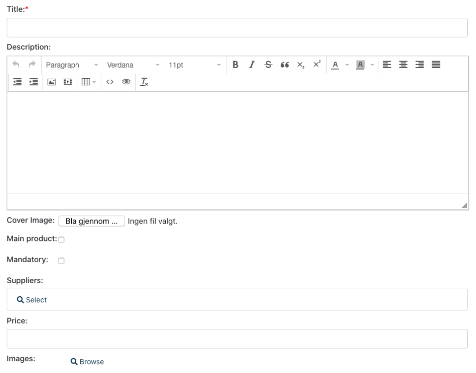

## 基本概念


### 设计理念
Digimaker CMF的设计理念是, 通过一些模型配置, 自动生成类似于ORM的实体(Entity), 然后通过api来操作这些Entity来操作数据. 这好像与一般web框架一样, 但Digimaker的基本数据类型是自带功能的. 

比如你定义一个属性"标题", 其类型是text(文本), 它在输入时自动就是个文本框(带验证功能); 如果你定义一个属性"封面图片", 其类型是image(图片), 在输入时系统提供图片上传的界面. 

下面的截屏是后台管理的输入界面, 里面所有的属性都是通过配置添加的, 当然你也可以创建自己的数据类型(我们叫域类型-fieldtype), 你也可以调用前台api来显示属性, 而不需要管它是怎么存储的.





典型的域类型有: 文本, 富文本, 图片, 数字, 时间, 关系(与其它内容关联起来).

下面是一个模型配置的例子:

```json
 "article": {
    "Name": "Article",
    "table_name": "dm_article",
    "has_version": true,
    "has_location": true,
    "name_pattern": "{title}",
    "fields": [{
        "identifier": "title",
        "type": "text",
        "name": "标题",
        "required": true
      },
      {
        "identifier": "coverimage",
        "type": "image",
        "name": "封面图片",
        "required": false
      },
      {
        "identifier": "summary",
        "type": "richtext",
        "name": "简介",
        "required": false,
        "parameters": {
          "mode":"compact"
        }
      }
    ]
    }
```

所以从digimaker的角度看, 内容的定义比较广义, 除了一般意义上的文章、文件夹、图片、表单等是内容外, 像考试题、答案、产品是内容. 甚至定单也是内容, 因为我们允许混合数据类型, 比如数据库的整型与digimaker的文本是可以混合使用。因此digimaker可用于大部分一般的web系统开发. 相对于一般的cms网站系统digimaker提供更灵活的内容模型, 而相对web框架来说, digimaker提供与内容相关的功能(如输入界面, 查询操作api, 权限管理, 日志调试等).


### 配置模型

模型配置文件是config/contenttype.json, 配置好文件后运行命令可生成相应的实体(entity).

[模型配置文件参考文档](../references/contenttype)

以下是dmdemo的例子, 每次修改contenttype.json后需要运行此命令来更新对应的enitity, 生成的entity会在entity目录下(如dmdemo/entity).

```
cd dmdemo
dmapp=. go run /Users/xc/go/src/github.com/digimakergo/digimaker/codegen/contenttypes/gen.go
```

默认会输出如下信息

```
Generating content entities for /Users/xc/go/src/github.com/digimakergo/dmdemo
Generating article
Generating usergroup
Generating role
Generating user
Generating image
Generating file
Generating folder
Generating frontpage
```

